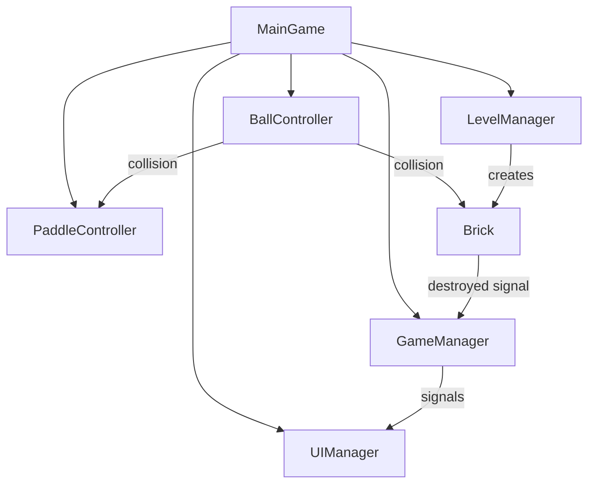

# Architecture Documentation

## Design Principles

This brick breaker game is built with the following architectural principles in mind:

### 1. Separation of Concerns
Each system has a single, well-defined responsibility:
- **GameManager**: Overall game state and flow
- **Controllers**: Handle specific game object behavior (paddle, ball)
- **Managers**: Handle system-wide concerns (levels, UI)
- **Components**: Self-contained game objects (bricks)

### 2. Signal-Based Communication
Systems communicate through Godot's signal system rather than direct references where possible, reducing coupling and improving maintainability.

### 3. Data-Driven Design
- Levels are defined in JSON files for easy modification
- Brick types and properties are configurable
- Game constants are exposed as export variables

### 4. Modular Extension Points
The architecture supports easy addition of new features:
- New brick types can be added by extending enums and updating factory methods
- New game modes can be implemented by extending the GameState system
- Power-ups can be added as new pickup components

## System Interactions



## File Organization

### `/scripts/managers/`
Core system managers that handle game-wide concerns:
- **GameManager**: Central state machine
- **LevelManager**: Level loading and brick management
- **UIManager**: User interface coordination

### `/scripts/controllers/`
Controllers for player-interactive game objects:
- **PaddleController**: Player input and paddle physics
- **BallController**: Ball movement and collision handling

### `/scripts/components/`
Self-contained game object components:
- **Brick**: Individual brick behavior and properties

### `/scripts/main/`
Scene orchestration and system initialization:
- **MainGameScript**: System setup and coordination

## Key Design Patterns

### 1. State Machine (GameManager)
```gdscript
enum GameState { READY, PLAYING, PAUSED, GAME_OVER }
var current_state: GameState = GameState.READY
```

### 2. Observer Pattern (Signals)
```gdscript
signal brick_destroyed(brick: Brick, score_value: int)
signal score_changed(new_score: int)
```

### 3. Factory Pattern (Level Creation)
```gdscript
static func create_brick(type: BrickType, pos: Vector2) -> Brick
```

### 4. Component System (Godot Nodes)
Each game object is composed of behavior components:
- Movement controllers
- Collision handlers
- Visual representation

## Performance Considerations

### Object Lifecycle Management
- Bricks are instantiated dynamically and cleaned up properly
- Ball physics use RigidBody2D for efficient collision detection
- UI updates are driven by signals to avoid polling

### Collision Detection
```gdscript
# Efficient collision layers
collision_layer = 1  # Ball layer
collision_mask = 2 | 4 | 8  # Paddle, bricks, walls
```

### Memory Management
- Proper use of `queue_free()` for object cleanup
- Signal disconnection handled automatically by Godot
- Minimal object creation during gameplay

## Extension Guidelines

### Adding New Features

1. **Identify the appropriate system** (Manager vs Controller vs Component)
2. **Define clear interfaces** using signals or method calls
3. **Update documentation** for any new public APIs
4. **Consider performance impact** of new features
5. **Maintain backward compatibility** when possible

### Code Style Standards

1. **Comprehensive Documentation**: Every class and public method documented
2. **Clear Naming**: Descriptive names that explain purpose
3. **Error Handling**: Graceful degradation when systems aren't available
4. **Logging**: Debug output for significant events
5. **Type Annotations**: Strong typing for better IDE support

### Testing Approach

While automated tests aren't currently implemented, the architecture supports testing:

1. **Modular Design**: Each system can be tested in isolation
2. **Signal-Based Communication**: Easy to mock system interactions
3. **Data-Driven Configuration**: Easy to create test scenarios
4. **Clear State Management**: Predictable system behavior

## Scalability Considerations

### Adding Multiple Levels
The current architecture easily supports:
- Level progression system
- Different brick layouts per level
- Level-specific properties and mechanics
- Save/load system for progress

### Performance Optimization
Future optimizations could include:
- Object pooling for frequently created/destroyed objects
- Spatial partitioning for collision detection at scale
- LOD systems for complex visual effects
- Configurable quality settings

### Multi-platform Deployment
The architecture supports cross-platform deployment:
- Input abstraction through Godot's action system
- Responsive UI design
- Configurable graphics settings
- Platform-specific optimizations

## Security and Robustness

### Error Resilience
- Null checks before accessing node references
- Graceful fallbacks when files are missing
- Input validation for level data

### Data Integrity
- JSON schema validation for level files
- Bounds checking for game values
- Safe type conversions

This architecture provides a solid foundation for the current game while supporting future enhancements and maintaining code quality.